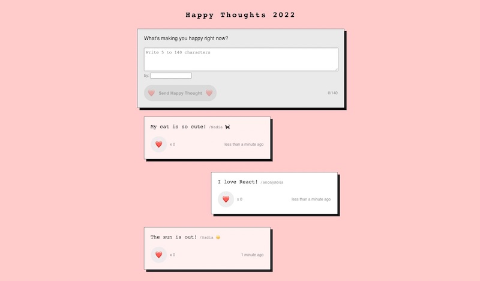

# Project Happy Thoughts 2022

Weekly project for Technigo's bootcamp, week 11: build an app like Twitter (March 2022)

## Tech stack

- JavaScript
- React
- HTML
- CSS
- API

## The problem

This week's project was to practice React state and effect hooks by fetching and posting data to an API, in a Twitter-like but more positive app. The structure was quite easy to set up. The project itself was simple but I struggled on too many details, like finding a way to refresh the likes (it was an issue about structure). If I had more time, I would have found an elegant way to add a loading state.

I'm happy with what my app looks like both on mobile and desktop. Tiny details make all the difference.

## View it live

Project deployed here: [Happy Thoughts 2022](https://happy-thoughts2022.netlify.app/)

**UPDATE**

This project has been updated with my own API built in week 19's project, which can be found here: 
* repository: (https://github.com/nadialefebvre/project-happy-thoughts-api)
* deployed site: (https://happy-thoughts-by-nadia-kijk33idxa-lz.a.run.app/thoughts)

  

